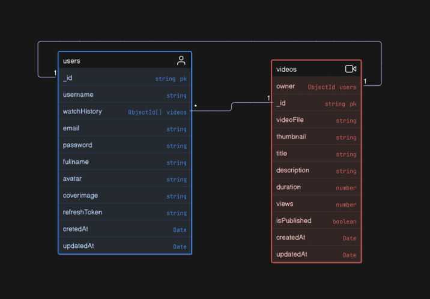

# user and video model



## user model

### Boiler plate code 
```js
import mongoose form "mongoose";
const UserSchema= new mongoose.Schema({
    // scema 
},{timestamps:true}); // create two feils createdAt , updatedAt 

export const User=mongoose.model("User",UserSchema);
```

### Schema 
```js
import mongoose form "mongoose";
const UserSchema= new mongoose.Schema(
    {
        username:{
            type:String,
            required:true,
            lowercase:true,
            trim:true,
            unique:true,
            index:true, //for faster and optimise search with in the database.
},
        email:{
            type:String,
            required:true,
            unique:true,
            lowercase:true,
            trim:true,

        },

        fullname:{
            type:String,
            required:true,
            trim:true,
        },

        avatar:{
            type:String,  // cloudinary image url -> cloud based image storage service.
            required:true,

            
        },
        coverImage:{
            type:String, // cloudinary image url .
            
        },
        watchHistory:[
            {
                type:mongoose.Schema.Types.ObjectId,
                ref:"Video",
            },
        ],
        password:{
            type:String,
            required:true,
        },
        refreshToken:{
            type:String,
        }, 
    
},

{timestamps:true}); // create two feils createdAt , updatedAt 

export const User=mongoose.model("User",UserSchema); // will be save as users 

```
### pasword encryption 

```js
UserSchema.pre("save", async function (next) {
    if (!this.isModified("password")) {
        return next();
    }
    this.password = await bcrypt.hash(this.password, 10);
});
```
The provided code snippet is a Mongoose middleware function that runs before a User document is saved to the database. This middleware is used to hash the user's password if it has been modified. Here's a detailed explanation of each part of the code:


### Breakdown:
#### Middleware Definition:
```js
UserSchema.pre("save", async function (next) {

})
```
UserSchema.pre("save", ...): This line defines a pre-save middleware for the UserSchema. The pre middleware runs before a document is saved to the database.
(pre->hook)

async function (next): The middleware function is defined as an asynchronous function, which allows the use of await within it. The next parameter is a callback function that needs to be called to proceed to the next middleware or to complete the save operation.

#### Check if Password is Modified:
```js
if (!this.isModified("password")) {
    return next();
}

```
if (!this.isModified("password")): This line checks if the password field has been modified. The this.isModified("password") method returns true if the password field has been changed, and false otherwise.
return next(): If the password field has not been modified, the middleware calls next() to proceed to the next middleware or to complete the save operation without hashing the password again.

#### Hash the Password:

```js
this.password = await bcrypt.hash(this.password, 10);
```

this.password: Refers to the password field of the current User document being saved.

saved.
await bcrypt.hash(this.password, 10): Uses the bcrypt library to hash the password. The bcrypt.hash function takes two arguments:

The plain text password (this.password).

The salt rounds (10), which determines the complexity of the hashing process.

The hashed password is then assigned back to this.password, replacing the plain text password.

## Purpose:
Security: Hashing the password before saving it to the database ensures that the plain text password is never stored. This enhances security by protecting user passwords in case the database is compromised.

Conditional Hashing: The check for isModified("password") ensures that the password is only hashed if it has been changed. This prevents unnecessary re-hashing of the password if other fields of the User document are modified.

## Summary

The UserSchema.pre("save", ...) middleware function ensures that the user's password is hashed before being saved to the database, but only if the password has been modified. This enhances security by storing only hashed passwords and avoids unnecessary re-hashing.