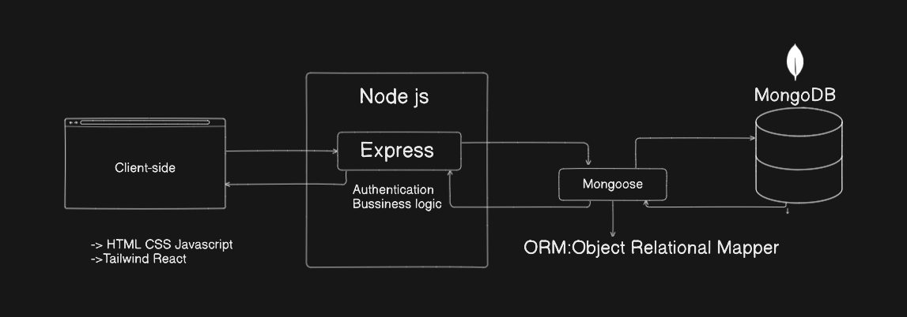

# Introducing Node

Node (or more formally Node.js) is an open-source, cross-platform runtime environment that allows developers to create all kinds of server-side tools and applications in JavaScript. The runtime is intended for use outside of a browser context (i.e. running directly on a computer or server OS). As such, the environment omits browser-specific JavaScript APIs and adds support for more traditional OS APIs including HTTP and file system libraries.

From a web server development perspective Node has a number of benefits:

- Great performance! Node was designed to optimize throughput and scalability in web applications and is a good solution for many common web-development problems (e.g. real-time web applications).

- Code is written in "plain old JavaScript", which means that less time is spent dealing with "context shift" between languages when you're writing both client-side and server-side code.
- JavaScript is a relatively new programming language and benefits from improvements in language design when compared to other traditional web-server languages (e.g. Python, PHP, etc.)
-  Many other new and popular languages compile/convert into JavaScript so you can also use TypeScript, CoffeeScript, ClojureScript, Scala, LiveScript, etc.
- The node package manager (npm) provides access to hundreds of thousands of reusable packages. It also has best-in-class dependency resolution and can also be used to automate most of the build toolchain.
- Node.js is portable. It is available on Microsoft Windows, macOS, Linux, Solaris, FreeBSD, OpenBSD, WebOS, and NonStop OS. Furthermore, it is well-supported by many web hosting providers, that often provide specific infrastructure and documentation for hosting Node sites.
- It has a very active third party ecosystem and developer community, with lots of people who are willing to help.

## Web Frameworks

Other common web-development tasks are not directly supported by Node itself. If you want to add specific handling for different HTTP verbs (e.g. GET, POST, DELETE, etc.), separately handle requests at different URL paths ("routes"), serve static files, or use templates to dynamically create the response, Node won't be of much use on its own. You will either need to write the code yourself, or you can avoid reinventing the wheel and use a web framework!

# Express js (Web-Framework)
Express is a popular web framework, written in JavaScript and hosted within the Node.js runtime environment. 

Express is the most popular Node.js web framework, and is the underlying library for a number of other popular Node.js frameworks. It provides mechanisms to:

- Write handlers for requests with different HTTP verbs at different URL paths (routes).
- Integrate with "view" rendering engines in order to generate responses by inserting data into templates.
- Set common web application settings like the port to use for connecting, and the location of templates that are used for rendering the response.
- Add additional request processing "middleware" at any point within the request handling pipeline.