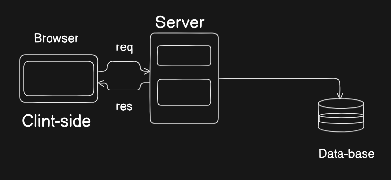
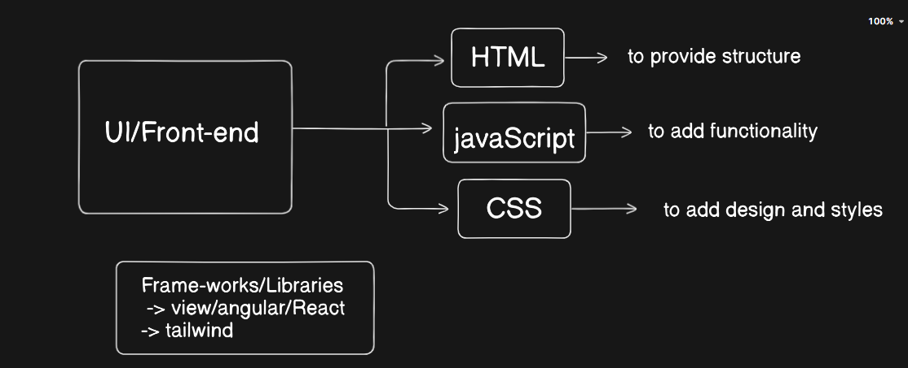

# Server side scripting /Back-end Development 
Web browser communicate with web server using (HTTP) . When you click a link on a web-page,submit a form or run a search,an http request is sent to server .

Web-server waits for clint's request message process them when they arrieved and reply to the web browser with http response message .

## Static vs Dynamic Website

### Static site : 
- showes same hardcoded content from the server when ever a perticular resource is requested  
- Read only content 
### Dynamic site :
- A dynamic site returns diffrent data from the server according  to the data being provided by users  
- Read and write 
- coustomised content .

*Most of the code to support Dynamic site must run on server --> creating this code is known as Server side Programming of Backend developmemnt 

-> All the Logic beside at server side 
## Clint-side Scripting 
Clint-side scripting deals with improving appearience and behaviour of rendring webpage 

## server-side 
Mostly involve in choosing which content is to return to browser in response to request 

### What can you do on server side ?

Server-side scripting is very usefull because it allows us to efficiently delever information tailored for individual users and there by create a much bettter user experience .
### Advantages 
- Efficient storage and delivery of information 
- Coustomised user experience
- Controlled eccess to the content 

Most large-scale websites use server-side code to dynamically display different data when needed, generally pulled out of a database stored on a server and sent to the client to be displayed via some code (e.g. HTML and JavaScript).

Perhaps the most significant benefit of server-side code is that it allows you to tailor website content for individual users. Dynamic sites can highlight content that is more relevant based on user preferences and habits. It can also make sites easier to use by storing personal preferences and information — for example reusing stored credit card details to streamline subsequent payments.

It can even allow interaction with users of the site, sending notifications and updates via email or through other channels. All of these capabilities enable much deeper engagement with users.

