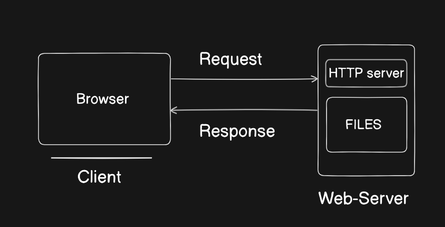

# Client-Server overview

## What is a web server?
The term web server can refer to hardware or software, or both of them working together.

- On the hardware side, a web server is a computer that stores web server software and a website's component files (for example, HTML documents, images, CSS stylesheets, and JavaScript files). 

A web server connects to the Internet and supports physical data interchange with other devices connected to the web.
- On the software side, a web server includes several parts that control how web users access hosted files.

At a minimum, this is an HTTP server. An HTTP server is software that understands URLs (web addresses) and HTTP (the protocol your browser uses to view webpages). An HTTP server can be accessed through the domain names of the websites it stores, and it delivers the content of these hosted websites to the end user's device.
## client-Server 

At the most basic level, whenever a browser needs a file that is hosted on a web server, the browser requests the file via HTTP. 

When the request reaches the correct (hardware) web server, the (software) HTTP server accepts the request, finds the requested document, and sends it back to the browser, also through HTTP. (If the server doesn't find the requested document, it returns a 404 response instead.)

To publish a website, you need either a static or a dynamic web server.

 - A static web server, or stack, consists of a computer (hardware) with an HTTP server (software). We call it "static" because the server sends its hosted files as-is to your browser.

 - A dynamic web server consists of a static web server plus extra software, most commonly an application server and a database.
 
  We call it "dynamic" because the application server updates the hosted files before sending content to your browser via the HTTP server.

 ##  Deeper dive
To review: to fetch a webpage, your browser sends a request to the web server, which searches for the requested file in its own storage space. Upon finding the file, the server reads it, processes it as needed, and sends it to the browser. Let's look at those steps in more detail.

### Hosting files
First, a web server has to store the website's files, namely all HTML documents and their related assets, including images, CSS stylesheets, JavaScript files, fonts, and video.

Technically, you could host all those files on your own computer, but it's far more convenient to store files all on a dedicated web server because:

- A dedicated web server is typically more available (up and running).
- Excluding downtime and system troubles, a dedicated web server is always connected to the Internet.
- A dedicated web server can have the same IP address all the time. This is known as a dedicated IP address. (Not all ISPs provide a fixed IP address for home lines.)
- A dedicated web server is typically maintained by a third party.

Second, a web server provides support for HTTP (Hypertext Transfer Protocol). As its name implies, HTTP specifies how to transfer hypertext (linked web documents) between two computers.

### On a web server, the HTTP server is responsible for processing and answering incoming requests.

- Upon receiving a request, an HTTP server checks if the requested URL matches an existing file.
If so, the web server sends the file content back to the browser. If not, the server will check if it should generate a file dynamically for the request (see Static vs. dynamic content).

- If neither of these options are possible, the web server returns an error message to the browser, most commonly 404 Not Found. The 404 error is so common that some web designers devote considerable time and effort to designing 404 error pages.

## Static vs. dynamic content

Roughly speaking, a server can serve either static or dynamic content. Remember that the term static means "served as-is".

The term dynamic means that the server processes the content or even generates it on the fly from a database. This approach provides more flexibility, but the technical stack is more complex, making it dramatically more challenging to build a website.

It is impossible to suggest a single off-the-shelf application server that will be the right solution for every possible use case. Some application servers are designed to host and manage blogs, wikis, or e-commerce solutions, while others are more generic. If you're building a dynamic website, take the time to research your requirements and find the technology that best fits your needs.